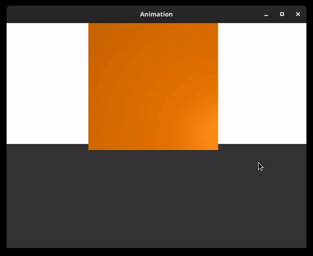

# Cloth Simulation Using Mass Spring Systems
Physics-based simulation of cloth using mass-spring systems.

## Features
- Cloth simulation with configurable parameters: 
    - Dimensions of the sheet
    - Mass of each particles
    - Spring constants 
    - Damping constants 
    - Fixed particles 
- Position based dynamics for structural constraints (instead of structural springs)
- Collisions with objects
    - Supported shapes: Sphere, cyclinder and rectangles
    - Inter particle collisions 
- Animation using keyframing
    - Creating shape heirarchies
    - Interpolation between keyframes using Catmull-Rom splines

## Demo 
<p align="center">
  
</p>
<p align="center">
  
</p>
<p align="center">
  
</p>
<p align="center">
  
</p>

## Installation
1. Install required packages: `SDL2`, `SDL2 Image`, `OpenGL`, `GLEW`, `CMake`.
```
# Ubuntu
sudo apt-get install -y libsdl2-image-dev libglm-dev libglew-dev libopengl-dev cmake
```
2. Create `build` directory in the project root.
```
mkdir build
```
3. Build the project
```
cd build
cmake ..
make
```
4. Run any of the examples: `e1`, `e2`, `e3`, ...


